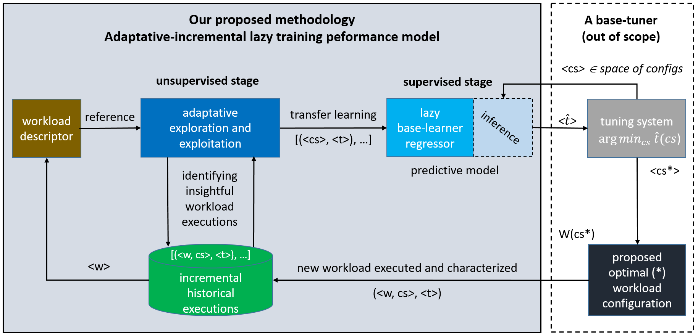

# Garralda-Performance-Model
## Adaptive Incremental Transfer Learning for Efficient Performance Modeling of Big Data Workloads

## Overview
The advent of data-intensive scalable computing systems, like Apache Spark, has revolutionized data processing by enabling efficient manipulation of
large datasets across machine clusters.
However, optimizing system configurations for performance remains a challenge.
This work presents an adaptive incremental transfer learning for predicting workload execution times.
By combining unsupervised and supervised learning stages, we build models that incrementally adapt to new workloads and configurations.
The model incorporates the Coefficient of Distance Variation and the Coefficient of Quality Correlation, forming the
Exploration-Exploitation Balance Coefficient, which guides optimal insightful workloads selection.
This research serves as an important component for an efficient performance tuning system, facilitating transfer learning from historical
workloads to new, unseen ones.

## Methodology
Garralda-Performance-Model integrates both unsupervised and supervised learning stages to incrementally leverage the knowledge of historical workload 
executions.
The unsupervised stage adaptively transfers learning from historical data by extracting insightful workload descriptors relative to a given
workload descriptor.
This stage allows our model to balance exploration and exploitation among the workload descriptors, selecting the most relevant neighbors.
The supervised stage is responsible for lazily training the base-learner regressor to predict execution time, accounting for noise and outliers in
new configurations of the reference workload descriptor.
Below illustrates the comprehensive workflow of the proposed methodology.



## Features
- Optimal neighbor selection using exploration-exploitation balance coefficient.
- Non-negative least squares regression for lazy performance prediction.
- Scalable and adaptable to various big data workloads.

## Usage
Example command to use the performance model for predicting execution times of new configurations.

```sh
    from perf_model import GarraldaPerformanceModel
    
    model = GarraldaPerformanceModel()

    # Option 1: To get the trained performance model and predict execution time for new configuration settings
    trained_model = model.train(workload_descriptors, config_settings, exec_times, workload_ref, k_min, k_max)
    predictions = trained_model.predict(new_config_settings)

    # Option 2: To lazy train and predict execution time for new configuration settings in one step
    predictions = model.predict(workload_descriptors, config_settings, exec_times, workload_ref, new_config_settings, k_min, k_max)
```

## License
This project is licensed under the MIT License for the software code. See the [LICENSE](LICENSE) file for more details.
Non-software content, such as documentation, is licensed under a [Creative Commons Attribution 4.0 International License](https://creativecommons.org/licenses/by/4.0/).

## Citation
If you use this project, its code, or any of its components in your research, publications, or any derivative work, please ensure proper citation as follows:

```bibtex
@misc{garralda-perf-model,
  author = {Mariano Garralda-Barrio and Carlos Eiras-Franco and Verónica Bolón-Canedo},
  title = {Adaptive incremental transfer learning for efficient performance modeling of big data workloads},
  year = {2024},
  howpublished = {\url{https://github.com/mgarralda/garralda-perf-model}},
  keywords = {Big data, Performance model, Apache Spark, Machine learning},
}
```

## Contact
For any questions or feedback, please contact [mariano.garralda@udc.es](mailto:mariano.garralda@udc.es)
