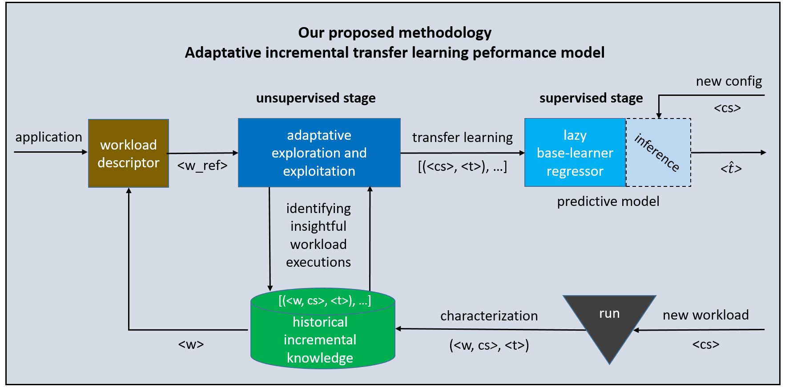

# Garralda-Performance-Model
## Adaptive Incremental Transfer Learning for Efficient Performance Modeling of Big Data Workloads
👉 [Original paper](https://www.sciencedirect.com/science/article/pii/S0167739X25000251)

## Overview
The advent of data-intensive scalable computing systems, like Apache Spark, has revolutionized data processing by enabling efficient manipulation of large datasets across machine clusters.
However, optimizing system configurations for performance remains a challenge.
This work presents an adaptive incremental transfer learning for predicting workload execution times.
By combining unsupervised and supervised learning stages, we build models that incrementally adapt to new workloads and configurations.
The model incorporates the Coefficient of Distance Variation and the Coefficient of Quality Correlation, forming the
Exploration-Exploitation Balance Coefficient, which guides optimal insightful workloads selection.
This research serves as an important component for an efficient performance tuning system, facilitating transfer learning from historical
workloads to new, unseen ones.

## Methodology
In the context of machine learning, the terms adaptive and incremental are often used interchangeably but convey distinct concepts.
Overall, incremental learning refers to a process where updates are made gradually over time as new data becomes available, without retraining the
entire model from scratch.
Adaptive learning, on the other hand, emphasizes the model's ability to adjust its parameters, structure, or predictions in response to new
information or changing conditions.
Specifically, in our approach, adaptive learning refers to the capability of balancing between exploration and exploitation in selecting the most
insightful workload descriptors in the latent representation.
Incremental learning is the ability to continuously deal with new workload executions efficiently due to the potential to lazily train the predictive
model.

Garralda-Performance-Model integrates both unsupervised and supervised learning stages to incrementally leverage the knowledge of historical workload 
executions.
The unsupervised stage adaptively transfers learning from historical data by extracting insightful workload descriptors relative to a given
workload descriptor.
This stage allows our model to balance exploration and exploitation among the workload descriptors, selecting the most relevant neighbors.
The supervised stage is responsible for lazily training the base-learner regressor to predict execution time, accounting for noise and outliers in
new configurations of the reference workload descriptor.
Below illustrates the comprehensive workflow of the proposed methodology.



## Features
- Optimal neighbor selection using exploration-exploitation balance coefficient.
- Non-negative least squares regression for lazy performance prediction.
- Scalable and adaptable to various big data workloads.

## Citation

If you use this project, its methodology, code, datasets, workload descriptors, or derived components in research, benchmarking studies, technical documentation, or derivative works, please cite the associated article and/or doctoral thesis.

### Article

```bibtex
@article{GARRALDABARRIO2025107730,
    title = {Adaptive incremental transfer learning for efficient performance modeling of big data workloads},
    journal = {Future Generation Computer Systems},
    pages = {107730},
    year = {2025},
    issn = {0167-739X},
    doi = {https://doi.org/10.1016/j.future.2025.107730},
    url = {https://www.sciencedirect.com/science/article/pii/S0167739X25000251},
    author = {Mariano Garralda-Barrio and Carlos Eiras-Franco and Verónica Bolón-Canedo},
    keywords = {Performance modeling, Big data, Machine learning, Apache Spark, Distributed computing}
}
```

### Doctoral Thesis

```bibtex
@phdthesis{GarraldaBarrio2026,
    author    = {Mariano Garralda Barrio},
    title     = {AI-Driven Optimization in Distributed Computing Systems: A Self-Tuning Framework},
    school    = {University of Coruña},
    year      = {2026},
    type      = {Doctoral Thesis},
    url       = {https://hdl.handle.net/2183/48114}
}
```

### References

- Garralda-Barrio, M., Eiras-Franco, C., & Bolón-Canedo, V. (2025).  
  *Adaptive incremental transfer learning for efficient performance modeling of big data workloads*.  
  Future Generation Computer Systems.  
  https://doi.org/10.1016/j.future.2025.107730

- Garralda Barrio, M. (2026).  
  *AI-Driven Optimization in Distributed Computing Systems: A Self-Tuning Framework*.  
  Doctoral Thesis, University of Coruña.  
  https://hdl.handle.net/2183/48114

## License
This project is licensed under the MIT License for the software code. See the [LICENSE](LICENSE) file for more details.
Non-software content, such as documentation, is licensed under a [Creative Commons Attribution 4.0 International License](https://creativecommons.org/licenses/by/4.0/).

## Citation
If you use this project, its code, or any of its components in your research, publications, or any derivative work, please ensure proper citation as follows:

## Contact
For any questions or feedback, please contact [mariano.garralda@udc.es](mailto:mariano.garralda@udc.es)
